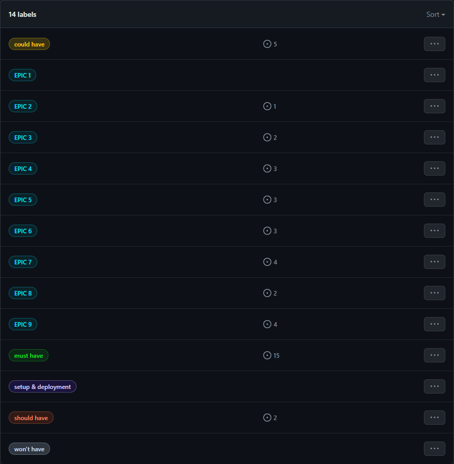

# **Agile Methodology**

## **Overview**

This project was created using Agile Methodology to split it in smaller tasks. To do so, I created user stories with acceptance criteria and grouped these into EPIC milestones so I can focus on one feature at the time.

### **EPIC**

In Agile tasks/user stories can be broken down into EPICS or Milestones. It's a helpful way to segment user stories based on needs/requests of end-users while working towards a fully functional project. 

I edited due dates few times due to illness and as I learned in proccess how long time certain tasks take or for example, realized I had my fonts chosen but needed few more days to see how it actually looks, as sometimes when all is added together, changes are needed.

EPIC 1

EPIC 2

EPIC 3

EPIC 4

EPIC 5

EPIC 6

EPIC 7

EPIC 8

EPIC 9

### **USER STORIES**

A user story serves as an explanation how a certain feature will provide a value to a user. They help developer to understand what and why they are building to provide a better end product overall.

[All user stories can be found following this link to my Github repository](https://github.com/violaberg/wine-o-clock/issues)

### **MoSCoW METHOD**

A MoSCoW Method is a popular prioritization technique used in many projects, not only software development. It uses a 4-step approach of "must-have", "should-have", "could-have" and "won't-have".

MoSCoW

### **GITHUB KANBAN BOARD**

Kanban board is one way how to provide a visual for project management, optimize workflow and increase efficiency. As it is my first time fully implementing Kanban board, ups and downs and some inaccuracy was expected.

Github Kanban

## **Conclusion**

 Using Agile was new to me, it was messy as with many things first time trying but a good way to learn and see how anything works is to try it in action. I had to edit due dates few times as I wasn't sure how long tasks take to complete, I forgot to close issues and epics as I got very unwell during start of the project unfortunately and thought of many different ways I could have done user stories. For example, I created user stories and then epics but later realized I should have created epics and then user stories. During development I created and edited few user stories as I came to better ideas for app 
 It's still not fully clear to me how sprints work using Kanban board while I understand the idea and benefit behind them, and plan to look into proper usage now that I'm finished. 
 Overall it was a great experience and kept me on track most of the time, as well as helped to understand how much is left to do as at times project felt never ending. 
 During this project I participated in hackathon and it was my first time being a SCRUM master which lead to even better understanding of Kanban board and how it works in real-life team work. I consider this experience very valuable and feel it helped me continue you with my own project.

[Back to Readme](README.md)