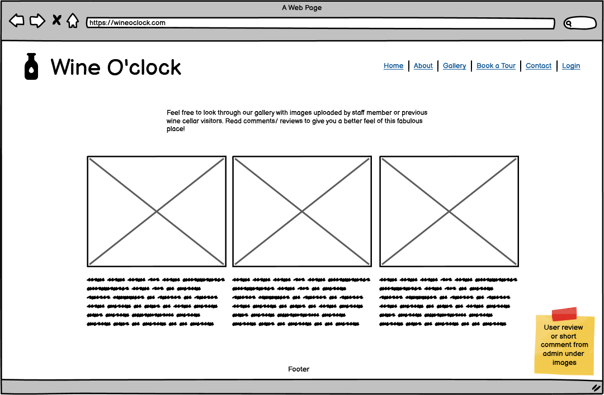
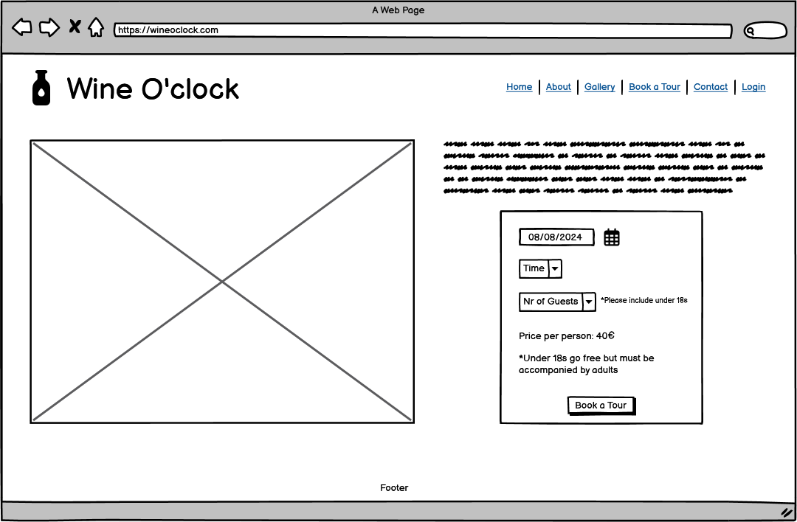
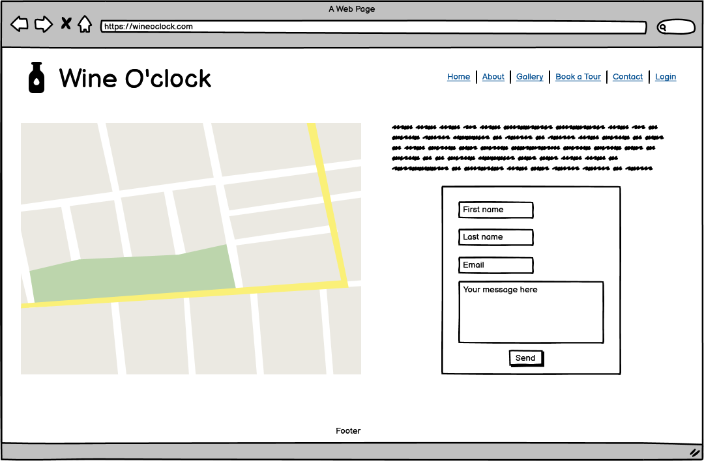
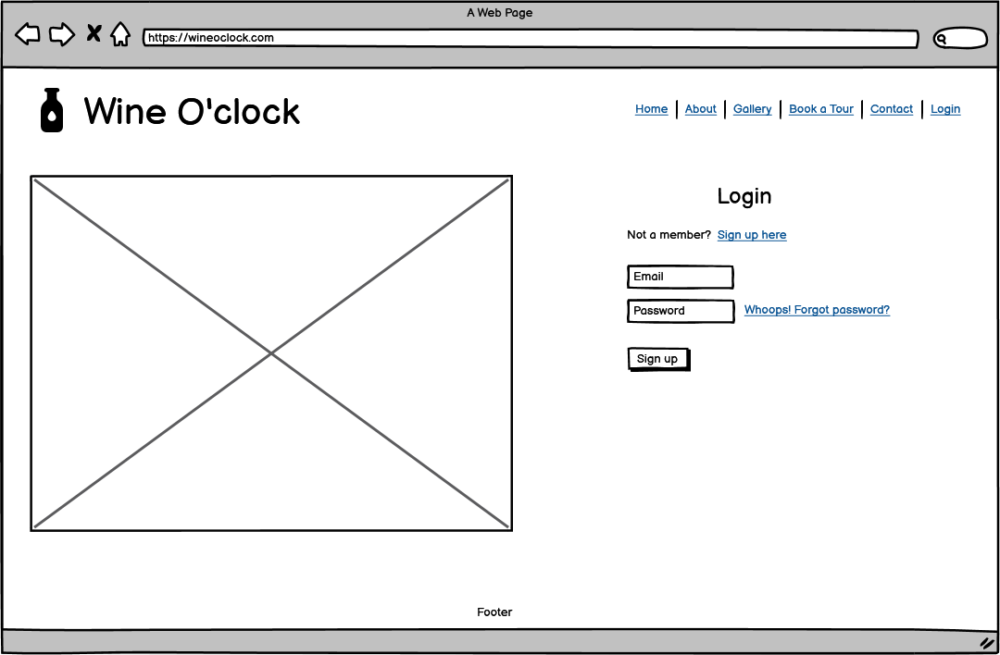
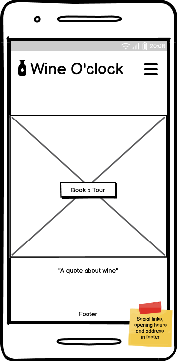
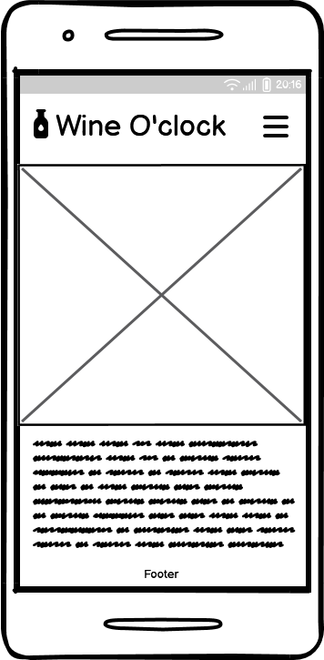
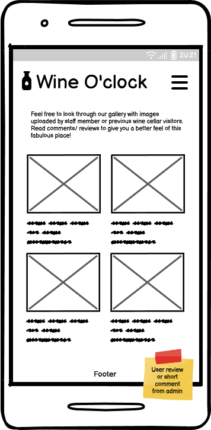
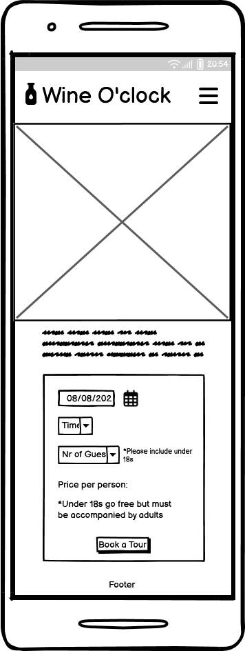

# **Wine O'Clock**

## **Overview**

    Wine O'Clock is a fictional wine cellar nested in the heart of the world-renowned Bordeaux wine region in France. Born from my deep passion for wine and the enchanting allure of France, this project invites enthusiasts to embark on an unforgettable journey into the captivating realms of winemaking. 
    The site shares a brief narrative about Wine O'Clock, offering a glimpse into its rich history and commitment to the craft. Immerse yourself in our curated gallery, adorned with exquisite photos captured by both owners and cherished visitors, creating a tapestry of memories that resonate with the essence of our vineyard. Whether you're a seasoned connoisseur or a curious explorer, the user-friendly Booking page ensures a seamless planning experience. For any additional information or inquiries, our Contact Us form is at your disposal. Wine O'Clock beckons, a celebration of passion, tradition, and the timeless beauty of French winemaking.

 

Deployed project can be found here: [Wine O'Clock]()

## **Table of Contents**
* [**Overview**](#overview)
* [**User experience**](#user-experience-ux)
    + [**Strategy plane**](#strategy-plane)
        - [**Site goals**](#site-goals)
        - [**Opportunities**](#opportunities)
    + [**Scope plane**](#scope-plane)
    + [**Structure plane**](#structure-plane)
        - [**Developer Tasks & User Stories**](#developer-tasks--user-stories)
        - [**Lucidchart**](#lucidchart)
    + [**Skeleton plane**](#skeleton-plane)
        - [**Wireframes**](#wireframes)
    + [**Surface plane**](#surface-plane)
        - [**Color Scheme**](#color-scheme)
        - [**Typography**](#typography)
* [**Agile Development**](#agile-development)
* [**Features & Future Development**](#features--future-development)
* [**Technologies used**](#technologies-used)
* [**Testing**](#testing)
* [**Deployment**](#deployment)
* [**Acknowledgement & Credits**](#acknowledgement--credits)

# **User experience (UX)**

During the planning phase I revisited UX videos provided on the course and used 5 planes to create my design.

## **Strategy plane**

### **Site goals**

* Offer a fully responsive user-friendly site to browse through.
* Implement fully functional features.
* Offer admin/user login with full CRUD funcionality.
* Create a welcoming space for wine enthusiasts to contribute their photos and reviews.
* Promote a passion for wine and travel.

### **Opportunities**

Opportunity | Importance | Viability/Feasibility
---|---|---
Age verification | 5 | 5
Newsletter list | 3 | 5
User register/login | 5 | 5
User profile | 3 | 1
User ability to add photos to gallery | 5 | 5
User reviews | 5 | 5
Full CRUD funcionality for user | 5 | 5
Full CRUD funcionality for admin | 5 | 5
Admin login via front end | 5 | 5
Password recovery | 5 | 5
Reservation management system for admin | 5 | 3
User ability to book a tour online | 5 | 5
User ability to edit/cancel booking online | 3 | 5
Booking confirmation on site | 5 | 5
Booking confirmation by email | 5 | 5
Booking reminder by email | 3 | 3
Option to pay for booking online | 3 | 1
About page | 5 | 5
Contact form | 5 | 5
Social media links | 3 | 5
Terms & conditions | 3 | 2
Wine blog | 3 | 2
---|---|---
Total |94|94

## **Scope plane**

Due to a incredible amount of new knowledge and deadline for this project as for anything in life and to avoid scope creep, I used MoSCoW method to keep project on track and concentrate on delivering fully functional site. Unfortunately, since beginning of the project I knew I won't have time to implement everything I would like to leaving some features for future development.

* Must Have:
    + Age verification
    + User register/login
    + User ability to add photos to gallery
    + User reviews
    + Full CRUD funcionality for user
    + Full CRUD funcionality for admin
    + Admin login via front end
    + Password recovery
    + User ability to book a tour online
    + Booking confirmation on page
    + Booking confirmation by email
    + About page
    + Contact form
    + Social media links

* Should Have:
    + Reservation management system for admin
    + User ability to edit/cancel booking online
    + Booking reminder by email

* Could Have:
    + Newsletter list
    + Terms & conditions
    + Wine blog

* Won't Have:
    + User profile
    + Option to pay for booking online

## **Structure plane**

### **Developer Tasks & User Stories**

|   EPIC                    |ID|    Task        |
|:--------------------------|--|:---------------|
|SET UP & DEPLOYMENT        |  ||
|                           |  | As a developer, I can create a new Github repository to store my project files online|
|                           |  | As a developer, I can create a new workspace on Gitpod, install Django and add required libraries to have access to cloudbased images and postgress database|
|                           |  | As a developer, I can create a Heroku app and deploy project early to confirm funcionality|
|                           |  ||

 

|   EPIC                    |ID|    User Story  |
|:--------------------------|--|:---------------|
|NAVIGATION AND CONTENT     |  ||
|                           |  | As a user, I want to navigate through site easily|
|                           |  | As a user, I want to clearly understand the purpose of the site|
|                           |  | As a user, I want to be able to read relative content|
|USER REGISTRATION & LOGIN  |  ||
|                           |  | As a user, I want to be able to register on the site|
|                           |  | As a user, I want to be able to login using email and password|
|                           |  | As a user, I want to be able to logout|
|BOOKING                    |  ||
|                           |  | As a logged-in user, I want to be able to book a tour|
|                           |  | As a logged-in user, I want to see my booking|
|                           |  | As a logged-in user, I want to be able to edit my booking|
|                           |  | As a logged-in user, I want to be able to cancel my booking|
|REVIEWS                    |  ||
|                           |  | As a user, I want to read reviews from other visitors|
|                           |  | As a logged-in user, I want to be able to leave a review|
|                           |  | As a logged-in user, I want to be able to edit my review|
|                           |  | As a logged-in user, I want to be able to delete my review|
|GALLERY                    |  ||
|                           |  | As a logged-in user, I want to be able to add my photo taken at wine cellar|
|CONTACT                    |  ||
|                           |  | As a user, I want to be able to see wine cellar's opening hours|
|                           |  | As a user, I want to be able to find wine cellar's location|
|                           |  | As a user, I want to be able to contact someone at wine cellar|
|ADMIN                      |  ||
|                           |  | As an admin, I can login via front end|
|                           |  | As an admin, I can add/edit content|
|                           |  | As an admin, I can delete inappropriate reviews/photos|
|DEVELOPER                  |  ||
|                           |  | As a developer, I can create a fully responsive site|
|                           |  | As a developer, I can choose color scheme and style of the website|
|                           |  ||

### **Lucidchart**

To help with a flow of app, I created flowchart using [Lucidchart](https://www.lucidchart.com/)

## **Skeleton plane**

### **Wireframes**

Wireframes for both desktop and mobile were created with [Balsamiq](https://balsamiq.com/) and can be below:

#### **Desktop wireframes:**

#### ***Home Page***

#### ***About Page***

#### ***Gallery Page***

#### ***Book a Tour***

#### ***Contact Page***

#### ***Login Page***

#### **Mobile wireframes:**

#### ***Home Page***

#### ***About Page***

#### ***Gallery Page***

#### ***Book a Tour***

#### ***Contact Page***

#### ***Login Page***

## **Surface plane**

### **Color Scheme**

### **Typography**

# **Agile Development**

I have included details of agile development in a separate file [AGILE.md](AGILE.md).

# **Features & Future Development**

# **Technologies used**

* HTML
* CSS
* Javascript
* Python
* Django
* Django allAuth
* [Heroku](https://www.heroku.com/)
* Heroku PostreSQL & [ElephantSQL](https://www.elephantsql.com/)
* Jinja
* [Tailwind CSS](https://tailwindcss.com/)
* [Font Awesome](https://fontawesome.com/)
* [Cloudinary](https://cloudinary.com/)

# **Testing**

I have included details of testing in a separate file [TESTING.md](TESTING.md).

# **Deployment**

I have included details of testing in a separate file [DEPLOYMENT.md](DEPLOYMENT.md).

# **Acknowledgement & Credits**

* The biggest thank you as always to my family during this busy time of juggling the biggest project so far, hackathon and life in general.
* Thank you as well to my mentor [David Bowers](https://github.com/dnlbowers) who supported me from the very beginning always giving the best advice and ideas for solutions and more importantly never losing hope in me, even when I did.
* And thank you to [Kim](https://github.com/kimatron) for continuous support and in general for convincing me to take on this course.
