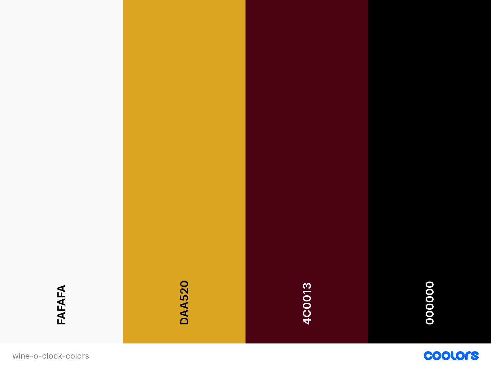

# **Wine O'Clock**

## **Overview**

Wine O'Clock is a fictional wine cellar nested in the heart of the world-renowned Bordeaux wine region in France. Born from my deep passion for wine and the enchanting allure of France, this project invites enthusiasts to embark on an unforgettable journey into the captivating realms of winemaking. 
The site shares a brief narrative about Wine O'Clock, offering a glimpse into its rich history and commitment to the craft. Immerse yourself in our curated gallery, adorned with exquisite photos captured by owners, reviews left by cherished visitors, creating a tapestry of memories that resonate with the essence of our vineyard, or read our blog if you crave some more info about all things wine. Whether you're a seasoned connoisseur or a curious explorer, Wine O'Clock has something for everyone. For booking or any additional information, our Contact form is at your disposal. Wine O'Clock beckons, a celebration of passion, tradition, and the timeless beauty of French winemaking.

 

Deployed project can be found here: [Wine O'Clock]()

## **Table of Contents**
* [**Overview**](#overview)
* [**User experience**](#user-experience-ux)
    + [**Strategy plane**](#strategy-plane)
        - [**Site goals**](#site-goals)
        - [**Opportunities**](#opportunities)
    + [**Scope plane**](#scope-plane)
    + [**Structure plane**](#structure-plane)
        - [**Developer Tasks & User Stories**](#developer-tasks--user-stories)
        - [**Flowchart**](#flowchart)
    + [**Skeleton plane**](#skeleton-plane)
        - [**Wireframes**](#wireframes)
    + [**Surface plane**](#surface-plane)
        - [**Color Scheme**](#color-scheme)
        - [**Typography**](#typography)
* [**Agile Development**](#agile-development)
* [**Features & Future Development**](#features--future-development)
* [**Technologies used**](#technologies-used)
* [**Testing**](#testing)
* [**Deployment**](#deployment)
* [**Acknowledgement & Credits**](#acknowledgement--credits)
* [**Media**](#media)

# **User experience (UX)**

During the planning phase I revisited UX videos provided on the course and used 5 planes to create my design.

## **Strategy plane**

### **Site goals**

* Offer a fully responsive user-friendly site to browse through.
* Implement fully functional features.
* Offer admin/user login with full CRUD funcionality.
* Create a welcoming space for wine enthusiasts to contribute their photos and reviews.
* Promote a passion for wine and travel.

### **Opportunities**

Opportunity | Importance | Viability/Feasibility
---|---|---
Age verification | 5 | 5
Newsletter list | 3 | 5
User register/login | 5 | 5
User profile | 3 | 1
User ability to add photos to gallery | 2 | 3
User ability to delete previously added photos | 2 | 3
User reviews | 5 | 5
Full CRUD funcionality for user | 5 | 5
Full CRUD funcionality for admin | 5 | 5
Admin login via front end | 5 | 5
Password recovery | 5 | 5
Reservation management system for admin | 5 | 3
User ability to book a tour online | 5 | 5
User ability to edit/cancel booking online | 3 | 3
Booking confirmation on site | 5 | 5
Booking confirmation by email | 5 | 5
Booking reminder by email | 3 | 3
Visible booking for logged-in user | 3 | 2
Option to pay for booking online | 3 | 1
About page | 5 | 5
Contact form | 5 | 5
Social media links | 3 | 5
Terms & conditions | 3 | 3
Wine blog | 2 | 2
---|---|---
Total |95|96

## **Scope plane**

Due to a incredible amount of new knowledge and deadline for this project as for anything in life and to avoid scope creep, I used MoSCoW method to keep project on track and concentrate on delivering fully functional site. Unfortunately, since beginning of the project I knew I won't have time to implement everything I would like to leaving some features for future development.

* Must Have:
    + Age verification
    + User register/login
    + User reviews
    + Full CRUD funcionality for user
    + Full CRUD funcionality for admin
    + Admin login via front end
    + Password recovery
    + User ability to book a tour online
    + Booking confirmation on page
    + Booking confirmation by email
    + About page
    + Contact form
    + Social media links

* Should Have:
    + Reservation management system for admin
    + Newsletter list
    + Booking reminder by email
    + Terms & conditions

* Could Have:
    + Visible booking for logged-in user
    + User ability to edit/cancel booking online
    + User ability to add photos to gallery
    + User ability to delete previously added photos
    + Wine blog

* Won't Have:
    + User profile
    + Option to pay for booking online

## **Structure plane**

### **Developer Tasks & User Stories**

|   EPIC                    |ID|    Task        |
|:--------------------------|--|:---------------|
|SET UP & DEPLOYMENT        |  ||
|                           |  | As a developer, I can create a new Github repository to store my project files online|
|                           |  | As a developer, I can create a new workspace on Gitpod, install Django and add required libraries to have access to cloudbased images and postgress database|
|                           |  | As a developer, I can create a Heroku app and deploy project early to confirm funcionality|
|                           |  ||

 

|   EPIC                    |ID|    User Story  |
|:--------------------------|--|:---------------|
|NAVIGATION AND CONTENT     |  ||
|                           |  | As a user, I can navigate through website easily|
|                           |  | As a user, I can clearly understand the purpose of the site|
|                           |  | As a user, I can read relevant content|
|USER REGISTRATION & LOGIN  |  ||
|                           |  | As a user, I can register on the site|
|                           |  | As a user, I can login using email and password|
|                           |  | As a user, I can logout|
|BOOKING                    |  ||
|                           |  | As a user, I can book a tour|
|                           |  | As a logged-in user, I can see my booking|
|                           |  | As a logged-in user, I can edit my booking|
|                           |  | As a logged-in user, I can cancel my booking|
|REVIEWS                    |  ||
|                           |  | As a user, I can read reviews from other visitors|
|                           |  | As a logged-in user, I can leave a review|
|                           |  | As a logged-in user, I can add my photo taken at wine cellar when leaving a review|
|                           |  | As a logged-in user, I can delete my previously added photo to review|
|                           |  | As a logged-in user, I can edit my review|
|                           |  | As a logged-in user, I can delete my review|
|GALLERY                    |  ||
|                           |  | As and admin, I can upload/ delete images from gallery |
|CONTACT                    |  ||
|                           |  | As a user, I can find wine cellar's opening hours|
|                           |  | As a user, I can find wine cellar's location|
|                           |  | As a user, I can contact someone at wine cellar|
|ADMIN                      |  ||
|                           |  | As an admin, I can login via front end|
|                           |  | As an admin, I can add/edit content|
|                           |  | As an admin, I can delete inappropriate reviews/photos|
|DEVELOPER                  |  ||
|                           |  | As a developer, I can create wireframes so that I can clearly see website layout|
|                           |  | As a developer, I can create a fully responsive site so that it is accessible on all devices|
|                           |  | As a developer, I can choose color scheme and style of the website it is pleasant to use|
|                           |  | As a developer, I can choose fonts so they match website style|
|                           |  ||

### **Flowchart**

To help with a flow of the website, I created a flowchart using [Draw.io](https://www.drawio.com/)

## **Skeleton plane**

### **Wireframes**

Wireframes for both desktop and mobile were created with [Balsamiq](https://balsamiq.com/) and can be seen below:

#### **Desktop wireframes:**

Home Page

About Page

Gallery Page

Book a Tour Page

Contact Page

Login Page

#### **Mobile wireframes:**

Home Page

About Page

Gallery Page

Book a Tour Page

Contact Page

Login Page

### **Database schema**

## **Surface plane**

### **Color Scheme**

The color palette chosen for Wine O'Clock app reflects a thoughtful blend of elegance and richness inspired by the world of wines. The soft and inviting Seasalt shade `#fafafa` serves as the symbol of the purity and clarity found in the process of winemaking. The use of Muted gold shade `#daa520` represents the allure of gold, mirroring the excellence and sophistication associated with wines bringing a sense of warmth to project. This golden hue speaks to the refined taste and quality that defines the Wine O'Clock experience. Accentuating the palette are deep, juicy tones of Bordeaux `#4c0013`, evoking the essence of rich red wines, and a Classic black `#000000`, representing the depth and complexity found in a perfectly aged bottle. Each color is carefully selected to embody the journey from vine to cellar, culminating in a visual harmony that encapsulates the luxurious world of Bordeaux wines at Wine O'Clock.

To add more depth and interest to design but not make it overwhelming for user to look at, I created a pattern for background using one my colors - Classic black `#000000`:

### **Typography**

In planning the visual identity of my website, I meticulously selected two fonts, Parisienne and Montserrat, to convey a harmonious blend of elegance and readability. Parisienne, with its delicate and flowing script, exudes a touch of sophistication, making it ideal for captivating headings that leave a lasting impression. Complementing this, Montserrat provides a clean and modern sans-serif typeface for content, ensuring optimal legibility and a seamless reading experience. Together, these fonts not only reflect the timeless allure of France and wine industry but also contribute to an aesthetically pleasing and engaging design, inviting visitors to explore our content with both style and clarity.

# **Agile Development**

I have included details of agile development in a separate file [AGILE.md](AGILE.md).

# **Features & Future Development**

# **Technologies used**

* HTML
* CSS
* Javascript
* Python
* Django
* Django allAuth
* Bootstrap
* [Heroku](https://www.heroku.com/)
* Heroku PostreSQL & [ElephantSQL](https://www.elephantsql.com/)
* Jinja
* Whitenoise
* Cloudinary
* Summernote

# **Testing**

I have included details of testing in a separate file [TESTING.md](TESTING.md).

# **Deployment**

I have included details of testing in a separate file [DEPLOYMENT.md](DEPLOYMENT.md).

# **Acknowledgement & Credits**

* [Pattern Monster](https://pattern.monster/) - background pattern
* [Google Fonts](https://fonts.google.com/) - fonts
* [Font Awesome](https://fontawesome.com/) - icons
* [Stack Overflow](https://stackoverflow.com/questions/29573163/django-admin-login-suddenly-demanding-csrf-token) - used to check if I remember correct how to set CSRF_TRUSTED_ORIGINS in settings 
* [Google groups](https://groups.google.com/g/django-users/c/RilA_RKi07c?pli=1) - used to resolve models.py issue
* Walkthrough blog code from Code Institute course used to set up register/ login/ logout/ blog and modified/ styled to suit my project.
* [Reddit](https://www.reddit.com/r/django/comments/3r1z4c/how_do_i_nuke_my_database_and_start_over/) - used to reset my database when I couldn't resolve migration errors.

* The biggest thank you as always to my family during this busy time of juggling the biggest project so far, hackathon and life in general.
* Thank you as well to my mentor [David Bowers](https://github.com/dnlbowers) who supported me from the very beginning always giving the best advice and ideas for solutions and more importantly never losing hope in me, even when I did.
* And thank you to [Kim](https://github.com/kimatron) for continuous support and in general for convincing me to take on this course.

# **Media**

## **Page images**
* [Vecteezy](https://www.vecteezy.com/) - Home page image by Chinnachart Martmoh, available at this [link](https://www.vecteezy.com/photo/6660921-red-wine-and-white-wine-in-a-glass-of-wine-wooden-tabletop-there-is-a-wine-cellar-on-the-table-and-red-and-green-grapes-the-background-is-an-underground-wine-cellar-3d-rendering)
* [Freepik](https://www.freepik.com/) - About page image by wirestock, available at this [link](https://www.freepik.com/free-photo/beautiful-shot-large-agricultural-field-countryside-with-hills-amazing-cloudy-sky_15695562.htm#page=2&query=wine%20cellar&position=24&from_view=search&track=ais&uuid=f149cfd0-a789-4804-9520-8783151b7d53)
* [Vecteezy](https://www.vecteezy.com/) - Reviews page image by somchai sanvongchaiya, available at this [link](https://www.vecteezy.com/photo/29630339-pouring-red-wine-into-a-glass-in-the-vineyard-french-red-wine)
* [Vecteezy](https://www.vecteezy.com/) - Contact page image by icon ade, available at this [link](https://www.vecteezy.com/photo/32944686-old-fashioned-letter-with-ancient-calligraphy-on-parchment)

## **Blog images**
* [Vecteezy](https://www.vecteezy.com/) - blog image by icon ade, available at this [link](https://www.vecteezy.com/photo/32937082-farmers-harvesting-fresh-fruit-in-the-autumn-sunlight-heat)
* [Vecteezy](https://www.vecteezy.com/) - blog image by Idalba Granada, available at this [link](https://www.vecteezy.com/photo/36222024-ai-generated-gourmet-food-wine-cheese-bread-and-variety-generated-by-ai)
* [Vecteezy](https://www.vecteezy.com/) - blog image by Idalba Granada, available at this [link](https://www.vecteezy.com/photo/36222005-ai-generated-gourmet-wineglass-on-table-celebrating-with-elegance-generated-by-ai)
* [Vecteezy](https://www.vecteezy.com/) - blog image by Chinnachart Martmoh, available at this [link](https://www.vecteezy.com/photo/6667071-red-and-white-wine-in-clear-glass-many-blurred-wine-whisky-and-brandy-bottle-backgrounds-place-it-on-a-wooden-and-mable-floor-with-a-wooden-board-wall-the-cellar-tasting-production-concept)

## **Review images**
* [Pexels](https://www.pexels.com/) - review image by Grape Things, available at this [link](https://www.pexels.com/photo/woman-in-white-long-sleeve-shirt-sitting-on-green-grass-field-7347162/)
* [Vecteezy](https://www.vecteezy.com/) - review image by Iftikhar Alam, available at this [link](https://www.vecteezy.com/photo/35779505-ai-generated-close-up-of-wineglasses-with-red-wine-in-vineyard-blurred-image-of-friends-toasting-wine-in-a-vineyard-in-the-daytime-outdoors-ai-generated)
* [Vecteezy](https://www.vecteezy.com/) - review image by Yulia Gapeenko, available at this [link](https://www.vecteezy.com/photo/29559149-woman-raises-her-wine-glass-to-a-couple-of-friends)

## **Gallery images**
* [Vecteezy](https://www.vecteezy.com/) - gallery image by Pierluigi Palazzi, available at this [link](https://www.vecteezy.com/photo/5893154-vineyard-with-tractor)
* [Vecteezy](https://www.vecteezy.com/) - gallery image by Chinnachart Martmoh, available at this [link](https://www.vecteezy.com/photo/6660079-red-wine-bottle-and-clear-glass-with-red-wine-put-on-a-wooden-tank-with-many-wine-fermentation-tanks-at-cellar-placed-close-to-the-red-brick-wall-3d-rendering)
* [Vecteezy](https://www.vecteezy.com/) - gallery image by icon ade, available at this [link](https://www.vecteezy.com/photo/30655839-vineyard-with-rows-of-vines-in-the-background-and)
* [Vecteezy](https://www.vecteezy.com/) - gallery image by Giuseppe Ramos, available at this [link](https://www.vecteezy.com/photo/25494680-sun-kissed-grapes-harvested-for-organic-winemaking-perfect-for-autumn-picnics-generated-by-ai)
* [Vecteezy](https://www.vecteezy.com/) - gallery image by Chinnachart Martmoh, available at this [link](https://www.vecteezy.com/photo/6666904-red-wine-in-clear-glass-red-grapes-green-grapes-and-wine-fermentation-tank-on-a-table-with-a-wooden-floor-or-tree-bark-the-background-image-was-a-morning-mountain-fog-and-morning-sun-3d-rendering)
* [Vecteezy](https://www.vecteezy.com/) - gallery image by Kseniia Chunaeva, available at this [link](https://www.vecteezy.com/photo/27895081-wine-barrels-in-a-old-wine-cellar)
* [Vecteezy](https://www.vecteezy.com/) - gallery image by Chinnachart Martmoh, available at this [link](https://www.vecteezy.com/photo/6666923-wooden-barrels-for-wine-fermentation-room-for-storing-multiple-wine-fermentation-tanks-the-brick-wall-is-red-orange-3d-rendering)
* [Vecteezy](https://www.vecteezy.com/) - gallery image by Irina Kryvasheina, available at this [link](https://www.vecteezy.com/photo/35756202-ai-generated-many-people-are-laughing-while-toasting)
* [Freepik](https://freepik.com/) - gallery image by freepik, available at this [link](https://www.freepik.com/free-photo/medium-shot-woman-tasting-wine_27260416.htm#fromView=search&page=1&position=7&uuid=edae1f89-c433-4e03-b036-d6e263e3f303)
* [Freepik](https://www.freepik.com/) - gallery image by pressfoto, available at this [link](https://www.freepik.com/free-photo/smell-wine_5402327.htm#fromView=search&page=1&position=42&uuid=edae1f89-c433-4e03-b036-d6e263e3f303)
* [Freepik](https://www.freepik.com/) - gallery image by lookstudio, available at this [link](https://www.freepik.com/free-photo/ginger-lady-green-trendy-dress-holding-glass-with-wine-sitting-with-short-haired-girl-white-cool-tshirt-outdoor_23993417.htm#fromView=search&page=2&position=7&uuid=edae1f89-c433-4e03-b036-d6e263e3f303)
* [Pexels](https://www.pexels.com/) - gallery image by furkanfdemir, available at this [link](https://www.pexels.com/photo/modern-restaurant-with-wine-cellar-in-daylight-6309844/)
