# **TESTING**

## **Table of Contents**
* [**User Story Testing**]()
* [**Code Validation**]()
    + [**HTML**]()
    + [**CSS**]()
    + [**JavaScript**]()
    + [**Python**]()
* [**Browser Testing**]()
* [**Device Testing**]()
* [**Lighthouse**]()
* [**Manual Testing**]()
    + [**Navigation**]()
    + [**Home Page**]()
    + [**About Page**]()
    + [**Gallery**]()
    + [**Book a Tour**]()
    + [**Contact Us Page**]()
    + [**Sign Up Page**]()
    + [**Login Page**]()
    + [**Logout Page**]()
* [**Responsiveness**]()
* [**Bugs & Fixes**]()

## **User Story Testing**

For the following, I will leave out the type of user, ***As a developer/admin/user, I can…***, and only list the latter part of the story as a heading.

### **EPIC 1 - Heroku and deployment:**

**...create new Github repository so that I can store project's files online** |passed |
|:---:|:---|
Create new repository |✓|
|||

**...set up new workspace so that I can start working on project** |passed |
|:---:|:---|
Create workspace on Gitpod using CI Gitpod full template |✓|
Install Django |✓|
Add required libraries and PostgreSQL database |✓|
|||

**...create a new Heroku app and deploy project early to confirm functionality** |passed |
|:---:|:---|
Create new Heroku app |✓|
Connect database |✓|
|||

### **EPIC 2 - Developer:**

**...create wireframes so that I can clearly see website layout** |passed |
|:---:|:---|
Create wireframe for desktop and mobile with Balsamiq |✓|
Export and save wireframes in project's doc/wireframes folder |✓|
|||

**...choose color scheme and style of the website so that it is pleasant to use** |passed |
|:---:|:---|
Color theme should be decided |✓|
Style of the project should be decided |✓|
|||

**...choose fonts so that they match website style** |passed |
|:---:|:---|
Choose two fonts - headings and body |✓|
Ensure fonts compliment each other |✓|
|||

**...create fully responsive website so that it is accessible on all devices** |passed |
|:---:|:---|
Design project with mobile first approach |✓|
Use Bootstrap and media queries to create responsive website |✓|
|||

### **EPIC 3 - Content:**

**...clearly understand the purpose of the website so that I know if I'm interested** |passed |
|:---:|:---|
I can see the purpose of website |✓|
|||

**...read relevant content so that I can stay informed** |passed |
|:---:|:---|
User can read content relevant to wine/ wine making |✓|
Content is easy to read and split in paragraphs |✓|
Content is relevant to each page on website |✓|
|||

### **EPIC 4 - Contact:**

**...contact someone at wine cellar so that I can receive any additional information needed or book a tour** |passed |
|:---:|:---|
Responsive and easy to use contact form with necessary fields |✓|
A confirmation of message sent |✓|
The Wine O'Clock site should prominently display contact information, including phone number, a contact form and/or email address |✓|
|||

**...find openings hours so that I know when can I visit** |passed |
|:---:|:---|
A dedicated section, on the Contact page or in the footer, that prominently displays the wine cellar's opening hours |✓|
The displayed opening hours should be regularly updated to reflect any changes |✓|
|||

**...find address so that I know wine cellar's location** |passed |
|:---:|:---|
Clearly visible address in footer |✓|
|||

### **EPIC 5 - User registration & login:**

**...register on site so that I can leave review, add photo and sign up to newsletter** |passed |
|:---:|:---|
Easy sign up form |✓|
User data stored and processed securely |✓|
Validation for user input |✓|
|||

**...login using email and password so that I don't have to remember username** |passed |
|:---:|:---|
Easy to fill login form |✓|
Validation for user input |✓|
|||

**...log out so that my data is safe** |passed |
|:---:|:---|
Clearly visible Log out button |✓|
Redirect user to Home page after logging out |✓|
|||

### **EPIC 6 - Admin:**

**...login so that I can access the admin panel to update site content** |passed |
|:---:|:---|
A secure login interface |✓|
Access to only authenticated admin |✓|
|||

**...add/edit content so that I'm in control of site** |passed |
|:---:|:---|
Access to a dashboard that facilitates the addition and editing of content |✓|
Functionality for admins to manage media assets, including uploading, deleting, or modifying images |✓|
User-friendly form to add new content |✓|
|||

**...delete inappropriate reviews/photos so that site is safe/relevant for users** |passed |
|:---:|:---|
The ability to identify and delete reviews deemed inappropriate or violating community guidelines |✓|
Able to identify and remove photos from the gallery |✓|
|||

### **EPIC 7 - Reviews:**

**...leave a review so that can contribute to the community and help other wine enthusiasts make informed decisions** |passed |
|:---:|:---|
The review submission form should include fields for the user to enter a title and written content |✓|
Review should be instantly visible on page |✓|
|||

**...add photos to reviews so that I can share my unique perspective and enhance the collective experience** |passed |
|:---:|:---|
An option to "Add Photo" within the review section |✓|
Clicking on "Add Photo" should offer a user-friendly way to do so |✓|
|||

**...edit my review so that I can update and refine my contributions, ensuring accuracy and relevance** |passed |
|:---:|:---|
Easily accessible an "Edit" button associated with each of the logged-in user's submitted reviews |✓|
After confirming the edits, updated review should immediately be visible |✓|
|||

**...read reviews so that to gain insights into their experiences at the wine cellar** |passed |
|:---:|:---|
Each review should display the user's name or a username and the date of the review |✓|
The review section should be responsive, ensuring a seamless experience across various devices and screen sizes |✓|
|||

**...delete my review so that I can have control over the content associated with myself** |passed |
|:---:|:---|
Easily accessible "Delete" button |✓|
Clicking on the "Delete" option should trigger a confirmation prompt, ensuring that user genuinely intends to remove review |✓|
Confirming the deletion should immediately remove my review from the site and show confirmation modal |✓|
|||

### **EPIC 8 - Gallery:**

**...add/delete images to gallery so that user can have a better feel of wine cellar** |passed |
|:---:|:---|
An easy-to-use option to manage gallery |✓|
Clearly visible confirmation after adding/deleting image |✓|
Gallery page should reflect changes without a delay |✓|
|||

### **EPIC 9 - Booking:**

**...book a tour so that I can visit "Wine O'Clock" wine cellar** |passed |
|:---:|:---|
Easy to follow booking form |✗ (future development)|
Clear booking confirmation |✗ (future development)|
User input validation |✗ (future development)|
|||

**...edit my booking so that I can make changes without contacting admin/staff** |passed |
|:---:|:---|
Easy-to-use edit booking form |✗ (future development)|
Clearly shown confirmation after editing |✗ (future development)|
Confirmation email sent with new booking data |✗ (future development)|
|||

**...cancel my booking so that I don't have to contact staff** |passed |
|:---:|:---|
Easy-to-use form to cancel booking |✗ (future development)|
Alert to confirm cancellation |✗ (future development)|
Email confirmation |✗ (future development)|
|||

**...see my booking so that I have a record of it** |passed |
|:---:|:---|
Clearly visible booking information |✗ (future development)|
|||

### **EPIC 10 - Posts:**

**...create draft posts so that I can finish writing the content later** |passed |
|:---:|:---|
A logged in admin can save a draft blog post |✓|
Then they can finish the content at a later time |✓|
|||

**...create, read, update and delete posts so that I can manage blog content** |passed |
|:---:|:---|
Logged in admin can create a blog post |✓|
Logged in admin can read a blog post |✓|
Logged in admin can edit a blog post |✓|
Logged in admin can delete a blog post |✓|
|||

**...click on a post so that I can read the full text** |passed |
|:---:|:---|
Detailed view of the post is seen when a blog post title is clicked on |✓|
|||

**...view a paginated list of posts so that I can easily browse through posts** |passed |
|:---:|:---|
If more than one post in the database, these multiple posts are listed |✓|
When a user opens the blog page a list of posts is seen |✓|
Visible post titles with pagination to choose what to read |✓|
|||

### **EPIC 11 - Comments:**

**...leave comments on a post so that I can express my thoughts** |passed |
|:---:|:---|
Easy-to-use form to add a comment |✓|
Given more than one comment on a post, user can reply once comment is approved |✓|
|||

**...approve / disapprove comments so that I can filter out objectionable comments** |passed |
|:---:|:---|
A logged in admin can approve a comment |✓|
A logged in admin can disapprove a comment |✓|
|||

**...edit & delete my own comment so that I can be involved in the conversation** |passed |
|:---:|:---|
A logged in user can edit their own comment |✓|
A logged in user can delete their own comment |✓|
|||

**...view comments on an individual post so that I can read the conversation** |passed |
|:---:|:---|
Given one or more user comments the admin can view them |✓|
Then a site user can click on the comment thread to read the conversation |✓|
|||

## **Code Validation**

### **HTML**

All HTML pages were validated using [W3C HTML Validator](https://validator.w3.org/).

|   PAGE                                     |  VALIDATOR SCREENSHOT                                     |   RESULT    |
|--------------------------------------------|-----------------------------------------------------------|-------------|
| Home Page                                  |

Home Page

| <mark>PASS</mark> |
| About Page                                 |

About Page

| <mark>PASS</mark> |
| Gallery Page                               |

Gallery

| <mark>PASS</mark> |
| Book a Tour                                |

Book a Tour

| <mark>PASS</mark> |
| Contact Page                               |

Contact Page

| <mark>PASS</mark> |
| Sign up Page                               |

Sign up Page

| <mark>PASS</mark> |
| Login Page                                 |

Login Page

| <mark>PASS</mark> |
| Logout Page                                |

Logout Page

| <mark>PASS</mark> |

### **CSS**

CSS was validated using [Jigsaw W3](https://jigsaw.w3.org/css-validator/)

### **JavaScript**

|   FILE                                     |  VALIDATOR SCREENSHOT                                     |   RESULT    |
|--------------------------------------------|-----------------------------------------------------------|-------------|
| reviews.js                                 |

reviews.js

| <mark>PASS</mark> ("one unidentified variable 'bootstrap'" ignored as it's caused by cross referencing scripts)|
| comments.js                                |

comments.js

| <mark>PASS</mark> ("one unidentified variable 'bootstrap'" ignored as it's caused by cross referencing scripts)|

### **Python**

All Python pages were validated using [CI Python Linter](https://pep8ci.herokuapp.com/)

| FILE        | VALIDATOR SCREENSHOT                                                                                                    | RESULT            |
| ----------- | ---------------------------------------------------------------------------------------------------------------------- | ----------------- |
| models.py   | 

Models

     | <mark></mark> |
| views.py    | 

Views

       | <mark></mark> |
| forms.py    | 

Forms

       | <mark></mark> |
| urls.py     | 

Urls

      | <mark></mark> |
| admin.py    | 

Admin

       | <mark></mark> |
| settings.py | 

Settings

 | <mark></mark> |

## **Browser Testing**

The website was tested on Google Chrome, Firefox and Microsoft Edge browsers.

## **Device Testing**

The website was tested on various devices using Chrome DevTools and real-life device, such as iPhone 12, Dell laptop and iPad Air.

## **Lighthouse**

| Page            |  Screenshot  |
| --------------- | ------------ |
| ***Desktop***   |              |
| Home            | 

Home
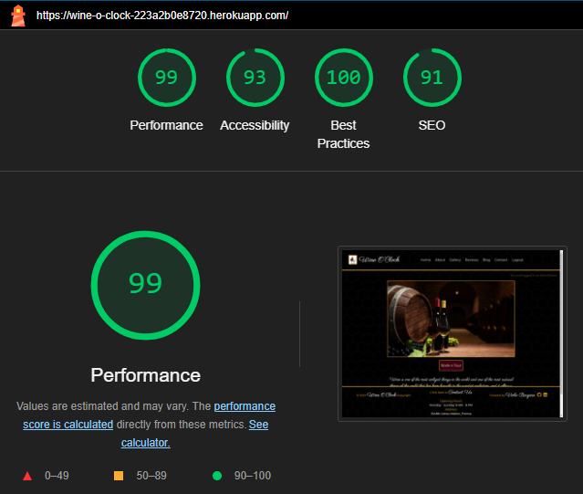
 |
| About           | 

About
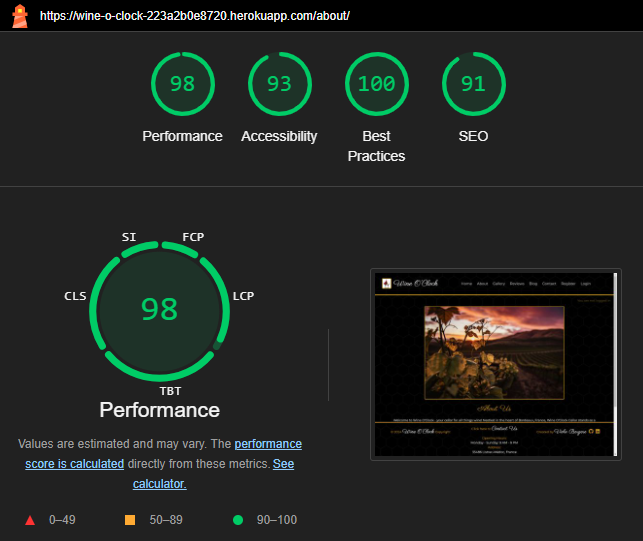
 |
| Gallery         | 

Gallery
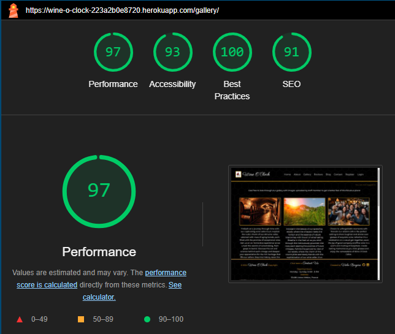
 |
| Reviews         | 

Reviews

 |
| Contact         | 

Contact
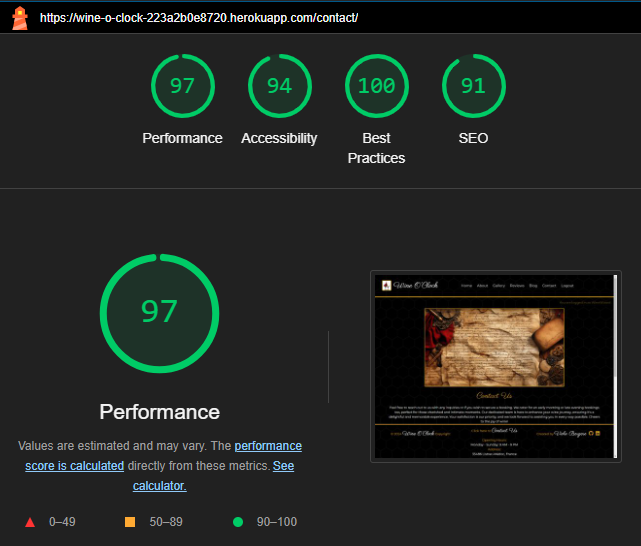
 |
| Sign Up         | 

Sign Up
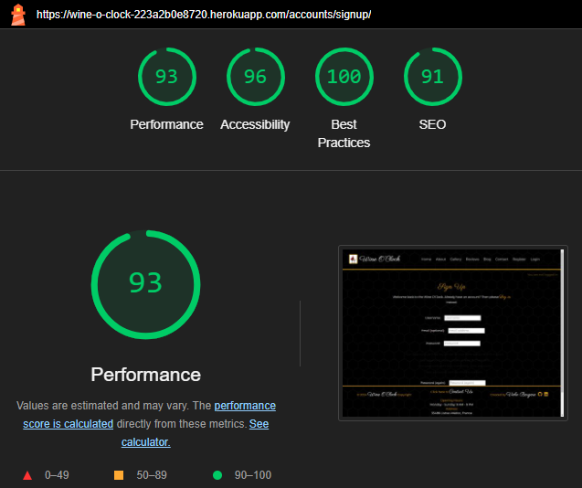
 |
| Login           | 

Login
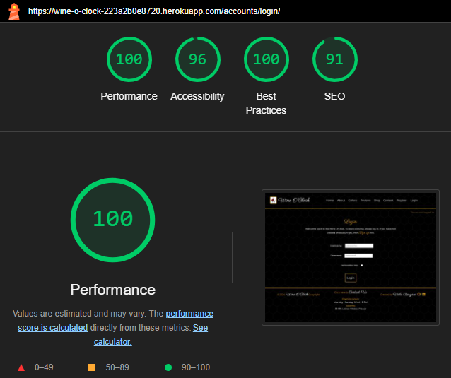
 |
| Logout          | 

Logout
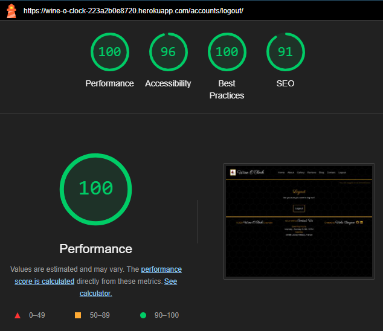
 |
| Blog            | 

Blog
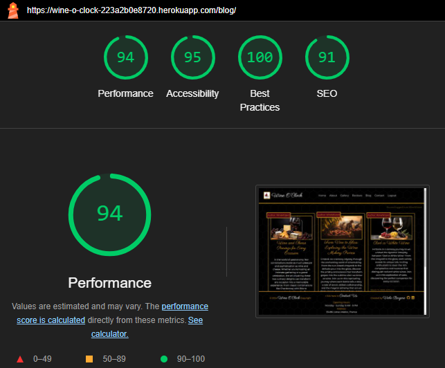
 |
| Blog Post       | 

 Post

 |
|  |  |

 

| Page            |  Screenshot  |
| --------------- | ------------ |
| ***Mobile***   |              |
| Home            | 

Home
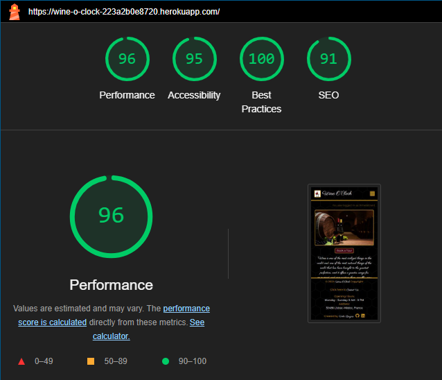
 |
| About           | 

About

 |
| Gallery         | 

Gallery
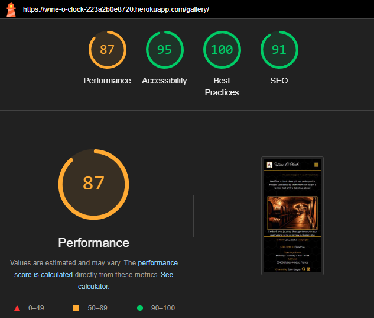
 |
| Reviews         | 

Reviews

 |
| Contact         | 

Contact

 |
| Sign Up         | 

Sign Up
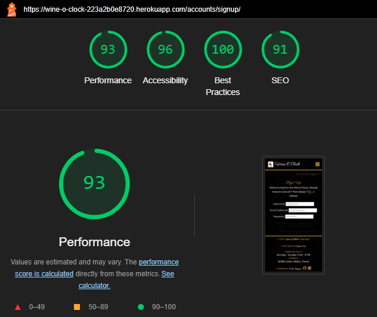
 |
| Login           | 

Login
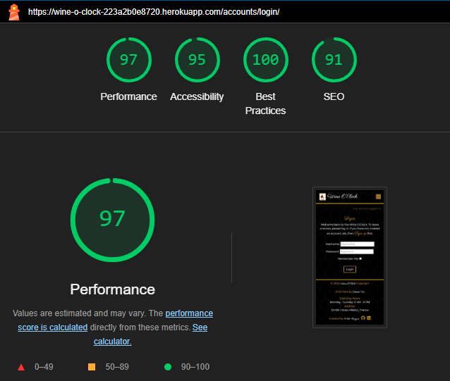
 |
| Logout          | 

Logout
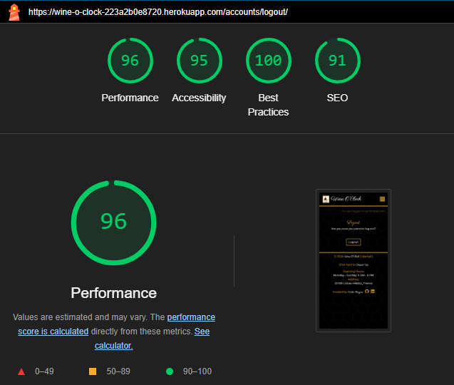
 |
| Blog            | 

Blog

 |
| Blog Post       | 

 Post
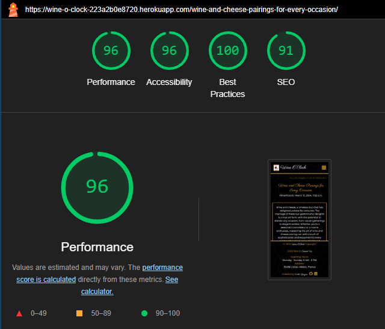
 |
|  |  |

## **Manual Testing**

### **Navigation**

| Element                | Action      | Expected Result                                         | Pass/Fail         |
| ---------------------- | ----------- | ------------------------------------------------------- | ----------------- |
| Logo                   | Click       | Redirect to Home page                                   | <mark></mark> |
| Home Link              | Click       | Redirect to Home page                                   |  |
| Register Link          | Click       | Redirect to sign up page                                |  |
| Log in Link            | Click       | Redirect to sign in page                                |  |
| Log out Link           | Click       | Redirect to log out page                                |  |
| Hamburger Menu         | Click       | Render a dropdown menu of all links                     |  |
| Footer Socials         | Click       | Redirect in a new tab to all respective media platforms |  |
| Footer Email           | Click       | Open up an email provider with developer email attached |  |
| Register Link          | Display     | Render for non authenticated users                      |  |
| Log in Link            | Display     | Render for non authenticated users                      |  |
| Log out Link           | Display     | Render only if user is authenticated                    |  |

### Home Page

| Element            | Action      | Expected Result                          | Pass/Fail         |
| ------------------ | ----------- | ---------------------------------------- | ----------------- |
| Book a Tour button | Click       | Redirect to Book a Tour page             | <mark></mark> |

### About Page

| Element            | Action      | Expected Result                          | Pass/Fail         |
| ------------------ | ----------- | ---------------------------------------- | ----------------- |
| Book a Tour button | Click       | Redirect to Book a Tour page             | <mark></mark> |

### Gallery Page

| Element            | Action      | Expected Result                          | Pass/Fail         |
| ------------------ | ----------- | ---------------------------------------- | ----------------- |
| Book a Tour button | Click       | Redirect to Book a Tour page             | <mark></mark> |

### Book a Tour

| Element            | Action      | Expected Result                          | Pass/Fail         |
| ------------------ | ----------- | ---------------------------------------- | ----------------- |
| Book a Tour button | Click       | Redirect to Book a Tour page             | <mark></mark> |

### Contact Page

| Element            | Action      | Expected Result                          | Pass/Fail         |
| ------------------ | ----------- | ---------------------------------------- | ----------------- |
| Book a Tour button | Click       | Redirect to Book a Tour page             | <mark></mark> |

### Review

| Element       | Action      | Expected Result                             | Pass/Fail         |
| ------------- | ----------- | ------------------------------------------- | ----------------- |
| Comment       | Display     | Render the review content, author and date  | <mark></mark> |
| Author Link   | Click       | Redirect to authors profile page            |  |
| Author Icon   | Click       | Redirect to authors profile page            |  |
| Delete Button | Display     | Render if authenticated author              |  |
| Delete Button | Click       | Delete Confirmation Modal appears           |  |
| Delete Button | Hover/Focus | Darken Background                           |  |

### Delete Confirmation Modal

| Element               | Action      | Expected Result                       | Pass/Fail         |
| --------------------- | ----------- | ------------------------------------- | ----------------- |
| Close Button          | Click       | Modal and opacic background disappear | <mark></mark> |
| Confirm Delete Button | Click       | Context item is delete from database  |  |
| Close Button          | Hover/Focus | Darken Background                     |  |
| Confirm Delete Button | Hover/Focus | Darken Background                     |  |

### Sign Up Page

| Element       | Action         | Expected Result                             | Pass/Fail         |
| ------------- | -------------- | ------------------------------------------- | ----------------- |
| Page          | Authentication | Authenticated users redirected to Home page | <mark></mark> |
| Form(Valid)   | Submit         | Redirected to Home page                     |  |
| Form(Valid)   | Submit         | Sign up in Notification received            |  |
| Form(Invalid) | Submit         | Error Context rendered to UI                |  |
| Form(Invalid) | Submit         | Error Notification received                 |  |
| Login Link    | Click          | Redirect to Login Page                      |  |
| Form Button   | Hover/Focus    | Darken Background                           |  |
| Login Link    | Hover/Focus    | Darken Text                                 |  |

### Login Page

| Element       | Action         | Expected Result                             | Pass/Fail         |
| ------------- | -------------- | ------------------------------------------- | ----------------- |
| Page          | Authentication | Authenticated users redirected to Home page | <mark></mark> |
| Form(Valid)   | Submit         | Redirected to Home page                     |  |
| Form(Valid)   | Submit         | Sign up in Notification received            |  |
| Form(Invalid) | Submit         | Error Context rendered to UI                |  |
| Form(Invalid) | Submit         | Error Notification received                 |  |
| Register Link | Click          | Redirect to Sign Up Page                    |  |
| Form Button   | Hover/Focus    | Darken Background                           |  |
| Register Link | Hover/Focus    | Darken Text                                 |  |

### Log Out Page

| Element       | Action         | Expected Result                                | Pass/Fail         |
| ------------- | -------------- | ---------------------------------------------- | ----------------- |
| Page          | Authentication | Un-authenticated users redirected to Home page | <mark></mark> |
| Logout Button | Click          | User session is Logged out                     |  |
| Logout Button | Click          | Redirected to Home page                        |  |
| Form Button   | Hover/Focus    | Darken Background                              |  |

## **Responsiveness**

Responsiveness was achieved using TailwindCSS and custom CSS and tested with Chrome DevTools making sure all pages adjust to screens starting from 280px wide.

## **Bugs & Fixes**

| Bug                                          | Cause                        | Solution                                                                              |
| -------------------------------------------- | ---------------------------- | ------------------------------------------------------------------------------------- |
| TemplateDoesNotExist at /base.html           | Incorrect base.html location | Delete unneccessary folder where base.html is located and move it to correct location |
| Images not displaying                        | Forgot to run collectstatic  | Running <code>python manage.py collectstatic</code> in terminal resolved the issue    |
| TemplateDoesNotExist at /gallery.html        | Incorrect gallery.html path in views.py | Adding 'wine_cellar' resolved the error <code>return render(request, 'wine_cellar/gallery.html', {'gallery_images': gallery_images})</code> |
| CSRF verification error when trying to login as admin | Missing CSRF_TRUSTED_ORIGINS in settings.py | Adding <code>CSRF_TRUSTED_ORIGINS=['https://8000-violaberg-wineoclock-3rc52bvzr9m.ws-eu108.gitpod.io']</code> resolved the issue |
| django.db.migrations.exceptions.InconsistentMigrationHistory | Didn't handle migrations correctly | Contacted tutor support and John very kindly helped me to reset database |
| Impossible to add a non-nullable field 'author' to review without specifying a default | No default value provided to new field in model | Added default='' to field resolved the issue |
| Review text not showing | Changed Review module field from text to body, forgot to change template | Changing <code>{{ review.text }}</code> to <code>{{ review.body }}</code> resolved the issue |
| Logo not showing on account pages | Wrong path <code></code> | Fixing path resolved it <code></code> |

[Back to Readme](README.md)